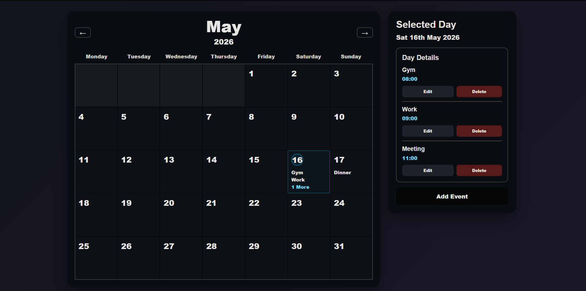
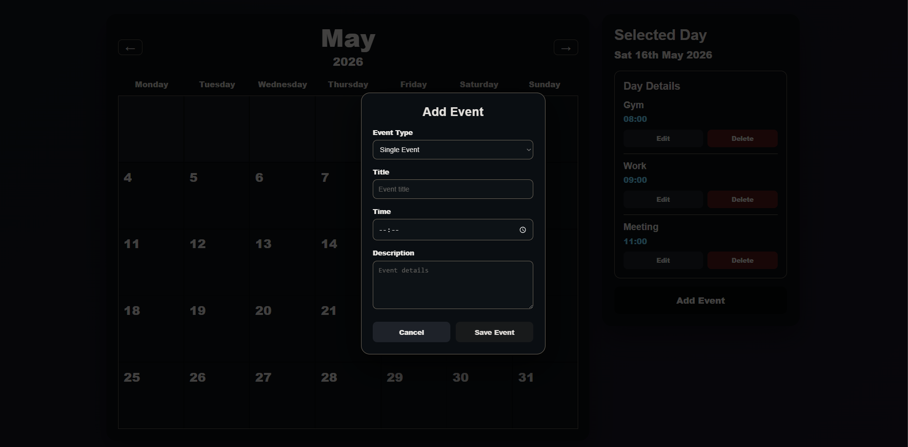

# Flask Calendar App

A responsive calendar web application built with Python, Flask, Jinja2, HTML, CSS and JSON storage.

This project allows users to browse between months, select individual days, add events, edit events, delete events and create yearly recurring events. It uses a simple JSON file for persistent storage, making it lightweight and easy to run locally without a database.

## Features

- Monthly calendar view
- Navigate between months
- Select a day to view events
- Add new events
- Edit existing events
- Delete events
- Single events
- Yearly recurring events
- JSON-based persistent storage
- Responsive dark UI
- Flask and Jinja2 templating

## Tech Stack

- Python
- Flask
- Jinja2
- HTML
- CSS
- JSON

